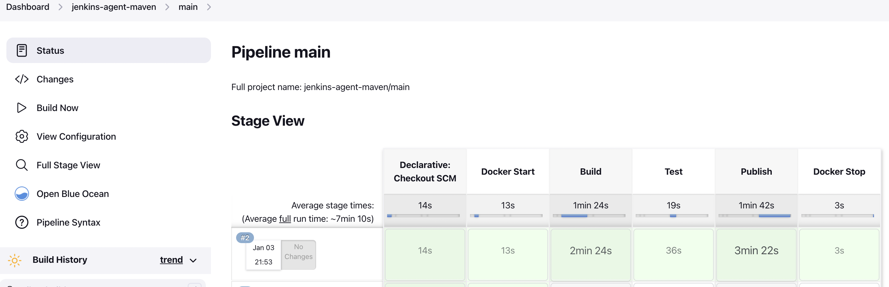

# Jenkins Agent Maven

This project is a docker-based build agent with the capability of building Maven. Specificaly:

- Maven 3.6.3
- OpenJDK 17

More importantly, the process for building **and testing** this agent is fully automated.

Prerequisites

- For building on Jenkins: https://github.com/jvalentino/jenkins-agent-docker
- For running Jenkins use Docker Agents: https://github.com/jvalentino/example-jenkins-docker-jcasc-2

# Locally

## Build

I wrote a script to run the underlying command:

```bash
$ ./build.sh 
+ docker build -t jvalentino2/jenkins-agent-maven .
[+] Building 1.1s (10/10) FINISHED                                                                           
 => [internal] load build definition from Dockerfile                                                    0.0s
 => => transferring dockerfile: 516B                                                                    0.0s
 => [internal] load .dockerignore                                                                       0.0s
 => => transferring context: 2B                                                                         0.0s
 => [internal] load metadata for docker.io/jenkins/agent:latest-jdk11                                   1.0s
 => [auth] jenkins/agent:pull token for registry-1.docker.io                                            0.0s
 => [1/5] FROM docker.io/jenkins/agent:latest-jdk11@sha256:cbafd026949fd9a796eb3d125a4eaa83aa876ac13ba  0.0s
 => CACHED [2/5] RUN apt-get update && apt-get install -y maven=3.6.3-5                                 0.0s
 => CACHED [3/5] RUN apt-get update && apt-get install -y openjdk-17-jdk                                0.0s
 => CACHED [4/5] RUN apt-get update &&     apt-get install ca-certificates-java &&     apt-get clean &  0.0s
 => CACHED [5/5] RUN export JAVA_HOME                                                                   0.0s
 => exporting to image                                                                                  0.0s
 => => exporting layers                                                                                 0.0s
 => => writing image sha256:d57738af252bc61fc48b2718f54a4d6fbf76bbc9eef35e7f725dc294ba600792            0.0s
 => => naming to docker.io/jvalentino2/jenkins-agent-maven                                              0.0s
```

The result is the image of `jvalentino2/jenkins-agent-maven`.

## Run

If you want to open a temporary shell into an instance of this image, run the following command:

```bash
$ ./run.sh 
+ docker compose run --rm jenkins_agent_maven
root@44dfaa674590:/home/jenkins# 
```

This opens a shell into container, where you can do things like verify the version of Maven and Java in use:

```bash
root@44dfaa674590:/home/jenkins# mvn -version
Apache Maven 3.6.3
Maven home: /usr/share/maven
Java version: 17.0.4, vendor: Debian, runtime: /usr/lib/jvm/java-17-openjdk-arm64
Default locale: en, platform encoding: UTF-8
OS name: "linux", version: "5.10.104-linuxkit", arch: "aarch64", family: "unix"
```

when done, just type:

```bash
root@5e02d6963730:/home/jenkins# exit
exit
~/workspaces/personal/jenkins-agent-maven $ 
```

It will kill the container and put you back at your own shell.

## Test

It is important to know that this container can actually build a maven project, so I script was included to launch the container and also run a maven build on the project within the workspace. It will then check for the specific files and return a non-zero exit code if they are not found.

```bash
$ ./test.sh
+ docker compose run --rm jenkins_agent_maven sh -c 'cd workspace; ./test.sh'
+ cd example-java-maven-lib-3
+ mvn -B -ntp clean verify
[INFO] Scanning for projects...
[INFO] 
[INFO] ----------------------< com.mycompany.app:my-app >----------------------
[INFO] Building my-app 1.0
[INFO] --------------------------------[ jar ]---------------------------------
[INFO] 
[INFO] --- maven-clean-plugin:3.1.0:clean (default-clean) @ my-app ---
[INFO] Deleting /home/jenkins/workspace/example-java-maven-lib-3/target
[INFO] 
[INFO] --- jacoco-maven-plugin:0.8.8:prepare-agent (jacoco-prepare) @ my-app ---
[INFO] argLine set to -javaagent:/root/.m2/repository/org/jacoco/org.jacoco.agent/0.8.8/org.jacoco.agent-0.8.8-runtime.jar=destfile=/home/jenkins/workspace/example-java-maven-lib-3/target/jacoco.exec
[INFO] 
[INFO] --- maven-resources-plugin:3.0.2:resources (default-resources) @ my-app ---
[INFO] Using 'UTF-8' encoding to copy filtered resources.
[INFO] skip non existing resourceDirectory /home/jenkins/workspace/example-java-maven-lib-3/src/main/resources
[INFO] 
[INFO] --- maven-compiler-plugin:3.8.0:compile (default-compile) @ my-app ---
[INFO] Changes detected - recompiling the module!
[INFO] Compiling 1 source file to /home/jenkins/workspace/example-java-maven-lib-3/target/classes
[INFO] 
[INFO] --- maven-resources-plugin:3.0.2:testResources (default-testResources) @ my-app ---
[INFO] Using 'UTF-8' encoding to copy filtered resources.
[INFO] skip non existing resourceDirectory /home/jenkins/workspace/example-java-maven-lib-3/src/test/resources
[INFO] 
[INFO] --- maven-compiler-plugin:3.8.0:testCompile (default-testCompile) @ my-app ---
[INFO] Changes detected - recompiling the module!
[INFO] Compiling 1 source file to /home/jenkins/workspace/example-java-maven-lib-3/target/test-classes
[INFO] 
[INFO] --- maven-surefire-plugin:2.22.1:test (default-test) @ my-app ---
[INFO] 
[INFO] -------------------------------------------------------
[INFO]  T E S T S
[INFO] -------------------------------------------------------
[INFO] Running com.mycompany.app.AppTest
[INFO] Tests run: 1, Failures: 0, Errors: 0, Skipped: 0, Time elapsed: 0.178 s - in com.mycompany.app.AppTest
[INFO] 
[INFO] Results:
[INFO] 
[INFO] Tests run: 1, Failures: 0, Errors: 0, Skipped: 0
[INFO] 
[INFO] 
[INFO] --- jacoco-maven-plugin:0.8.8:report (jacoco-report) @ my-app ---
[INFO] Loading execution data file /home/jenkins/workspace/example-java-maven-lib-3/target/jacoco.exec
[INFO] Analyzed bundle 'my-app' with 1 classes
[INFO] 
[INFO] --- maven-jar-plugin:3.0.2:jar (default-jar) @ my-app ---
[INFO] Building jar: /home/jenkins/workspace/example-java-maven-lib-3/target/my-app-1.0.jar
[INFO] 
[INFO] --- jacoco-maven-plugin:0.8.8:check (jacoco-check) @ my-app ---
[INFO] Loading execution data file /home/jenkins/workspace/example-java-maven-lib-3/target/jacoco.exec
[INFO] Analyzed bundle 'my-app' with 1 classes
[INFO] All coverage checks have been met.
[INFO] 
[INFO] >>> maven-pmd-plugin:3.19.0:check (default) > :pmd @ my-app >>>
[INFO] 
[INFO] --- maven-pmd-plugin:3.19.0:pmd (pmd) @ my-app ---
[WARNING] Unable to locate Source XRef to link to - DISABLED
[WARNING] Unable to locate Source XRef to link to - DISABLED
[INFO] PMD version: 6.49.0
[WARNING] Removed misconfigured rule: LoosePackageCoupling  cause: No packages or classes specified
[INFO] Rendering content with org.apache.maven.skins:maven-default-skin:jar:1.3 skin.
[INFO] 
[INFO] <<< maven-pmd-plugin:3.19.0:check (default) < :pmd @ my-app <<<
[INFO] 
[INFO] 
[INFO] --- maven-pmd-plugin:3.19.0:check (default) @ my-app ---
[INFO] PMD version: 6.49.0
[INFO] You have 11 PMD violations. For more details see: /home/jenkins/workspace/example-java-maven-lib-3/target/pmd.xml
[INFO] The build is not failed, since 11 violations are allowed (maxAllowedViolations).
[INFO] 
[INFO] >>> maven-pmd-plugin:3.19.0:cpd-check (default) > :cpd @ my-app >>>
[INFO] 
[INFO] --- maven-pmd-plugin:3.19.0:cpd (cpd) @ my-app ---
[WARNING] Unable to locate Source XRef to link to - DISABLED
[WARNING] Unable to locate Source XRef to link to - DISABLED
[INFO] PMD version: 6.49.0
[INFO] Rendering content with org.apache.maven.skins:maven-default-skin:jar:1.3 skin.
[INFO] 
[INFO] <<< maven-pmd-plugin:3.19.0:cpd-check (default) < :cpd @ my-app <<<
[INFO] 
[INFO] 
[INFO] --- maven-pmd-plugin:3.19.0:cpd-check (default) @ my-app ---
[INFO] PMD version: 6.49.0
[INFO] 
[INFO] ------------------------------------------------------------------------
[INFO] BUILD SUCCESS
[INFO] ------------------------------------------------------------------------
[INFO] Total time:  27.798 s
[INFO] Finished at: 2023-01-03T18:53:30Z
[INFO] ------------------------------------------------------------------------
+ echo ' '
 
+ echo Validation...
Validation...
+ '[' '!' -f target/pmd.xml ']'
+ '[' '!' -f target/my-app-1.0.jar ']'
+ '[' '!' -f target/jacoco.exec ']'
+ '[' '!' -f target/surefire-reports/TEST-com.mycompany.app.AppTest.xml ']'
+ echo 'Validation Done'
Validation Done
~/workspaces/personal/jenkins-agent-maven $ 
```

This works by included the project of https://github.com/jvalentino/example-java-maven-lib-3 in the workspace directory, where the workspace directory is mounted to the container volume via docker compose.

# On Jenkins

On Jenkins, the pipeline itself requires the image build from https://github.com/jvalentino/jenkins-agent-docker, which is jvalentino2/jenkins-agent-docker. The docker label on Jenkins must be mapped to that jvalentino2/jenkins-agent-docker image.


In this case though, the actual image in use in jvalentino2/jenkins-agent-docker:latest to always pull the latest.

The Jenkinsfile itself then calls the same commands as the Docker Agent, to build, test, and then publish that image to Dockerhub:

```groovy
pipeline {
 agent { label 'docker' }

 environment {
    IMAGE_NAME    = 'jvalentino2/jenkins-agent-maven'
    MAJOR_VERSION = '1'
    HUB_CRED_ID   = 'dockerhub'
  }

  stages {
    
    stage('Docker Start') {
      steps {
       dockerStart()
      }
    } // Docker Start

     stage('Build') {
      steps {
       build("${env.IMAGE_NAME}")
      }
    } // Build

    stage('Test') {
      steps {
       test()
      }
    } // Test
    
    stage('Publish') {
      steps {
        publish("${env.IMAGE_NAME}", "${env.MAJOR_VERSION}", "${env.HUB_CRED_ID}")
      }
    } // Publish

    stage('Docker Stop') {
      steps {
       dockerStop()
      }
    } // Docker Start

  }
}

def dockerStart() {
  sh '''
    nohup dockerd &
    sleep 10
  '''
}

def dockerStop() {
  sh 'cat /var/run/docker.pid | xargs kill -9 || true'
}

def build(imageName) {
  sh "docker build -t ${imageName} ."
}

def test() {
  sh "./test.sh"
}

def publish(imageName, majorVersion, credId) {
  withCredentials([usernamePassword(
      credentialsId: credId, 
      passwordVariable: 'DOCKER_PASSWORD', 
      usernameVariable: 'DOCKER_USERNAME')]) {
          sh """
              docker login --username $DOCKER_USERNAME --password $DOCKER_PASSWORD
              docker tag ${imageName}:latest ${imageName}:${majorVersion}.${BUILD_NUMBER}
              docker tag ${imageName}:latest ${imageName}:latest
              docker push ${imageName}:${majorVersion}.${BUILD_NUMBER}
              docker push ${imageName}:latest
          """
      }
}
```

Note that I wrote groovy methods to handle running the underlying commands via different stages.

This is primarily because the different stages now can take more time:

