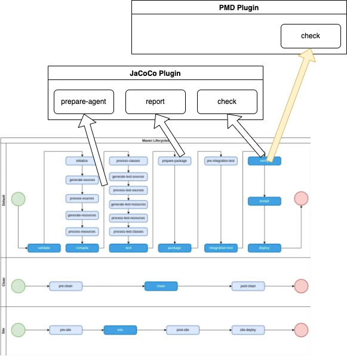
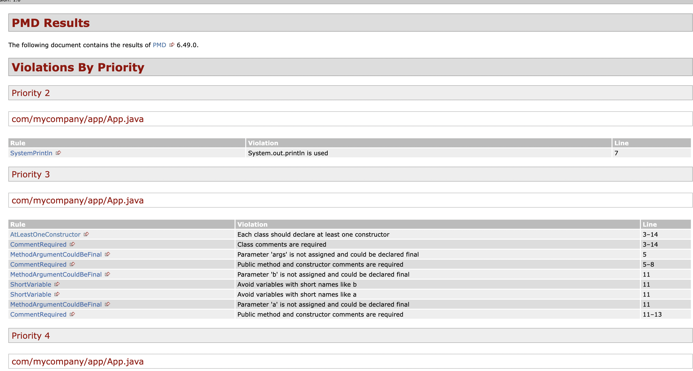

# Example Java Library using Maven: Part 3

The purpose of this project is to be a basic Java library that is built using Maven, with the intention of showing how to add static code analysis with a quality gate via PMD.

Prerequisites

- Git Setup: https://github.com/jvalentino/setup-git
- Building Java 101: https://github.com/jvalentino/java-building-101
- Maven-Java Part 1: https://github.com/jvalentino/example-java-maven-lib-1
- Maven-Java Part 2: https://github.com/jvalentino/example-java-maven-lib-2

# (1) What is static code analysis?

> In [computer science](https://en.wikipedia.org/wiki/Computer_science), **static program analysis** (or **static analysis**) is the [analysis](https://en.wikipedia.org/wiki/Program_analysis) of computer programs performed without executing them, in contrast with [dynamic program analysis](https://en.wikipedia.org/wiki/Dynamic_program_analysis), which is performed on programs during their execution.[[1\]](https://en.wikipedia.org/wiki/Static_program_analysis#cite_note-1)[[2\]](https://en.wikipedia.org/wiki/Static_program_analysis#cite_note-2)
>
> The term is usually applied to analysis performed by an automated tool, with human analysis typically being called "program understanding", [program comprehension](https://en.wikipedia.org/wiki/Program_comprehension), or [code review](https://en.wikipedia.org/wiki/Code_review). In the last of these, [software inspection](https://en.wikipedia.org/wiki/Software_inspection) and [software walkthroughs](https://en.wikipedia.org/wiki/Software_walkthrough) are also used. In most cases the analysis is performed on some version of a program's [source code](https://en.wikipedia.org/wiki/Source_code), and, in other cases, on some form of its [object code](https://en.wikipedia.org/wiki/Object_code)

- https://en.wikipedia.org/wiki/Static_program_analysis

# (2) What is PMD?

> PMD is a source code analyzer. It finds common programming flaws like unused variables, empty catch blocks, unnecessary object creation, and so forth. It supports Java, JavaScript, Salesforce.com Apex and Visualforce, PLSQL, Apache Velocity, XML, XSL.
>
> Additionally it includes CPD, the copy-paste-detector. CPD finds duplicated code in Java, C, C++, C#, Groovy, PHP, Ruby, Fortran, JavaScript, PLSQL, Apache Velocity, Scala, Objective C, Matlab, Python, Go, Swift and Salesforce.com Apex and Visualforce.

- https://pmd.github.io/

# (3) Using the PMD Plugin

## pom.xml

```xml
<!-- PMD -->
        <plugin>
          <groupId>org.apache.maven.plugins</groupId>
          <artifactId>maven-pmd-plugin</artifactId>
          <version>3.19.0</version>
          <configuration>
            <rulesets>
              <ruleset>config/pmd-java.xml</ruleset>
            </rulesets>
           
          </configuration>
          <executions>
            <execution>
              <goals>
                <goal>check</goal>
                <goal>cpd-check</goal>
              </goals>
            </execution>
          </executions>
        </plugin>
```


## config/pmd-java.xml

PMD requires a ruleset, and this file is every single PMD rule available from java, as obtained from https://github.com/pmd/pmd/blob/master/pmd-core/src/main/resources/rulesets/internal/all-java.xml

## New Life Cycle



## Running it

```bash
~/workspaces/personal/example-java-maven-lib-3 $ ./mvnw clean verify

[INFO] Scanning for projects...
[INFO] 
[INFO] ----------------------< com.mycompany.app:my-app >----------------------
[INFO] Building my-app 1.0
[INFO] --------------------------------[ jar ]---------------------------------
[INFO] 
[INFO] --- maven-clean-plugin:3.1.0:clean (default-clean) @ my-app ---
[INFO] Deleting /Users/john.valentino/workspaces/personal/example-java-maven-lib-3/target
[INFO] 
[INFO] --- jacoco-maven-plugin:0.8.8:prepare-agent (jacoco-prepare) @ my-app ---
[INFO] argLine set to -javaagent:/Users/john.valentino/.m2/repository/org/jacoco/org.jacoco.agent/0.8.8/org.jacoco.agent-0.8.8-runtime.jar=destfile=/Users/john.valentino/workspaces/personal/example-java-maven-lib-3/target/jacoco.exec
[INFO] 
[INFO] --- maven-resources-plugin:3.0.2:resources (default-resources) @ my-app ---
[INFO] Using 'UTF-8' encoding to copy filtered resources.
[INFO] skip non existing resourceDirectory /Users/john.valentino/workspaces/personal/example-java-maven-lib-3/src/main/resources
[INFO] 
[INFO] --- maven-compiler-plugin:3.8.0:compile (default-compile) @ my-app ---
[INFO] Changes detected - recompiling the module!
[INFO] Compiling 1 source file to /Users/john.valentino/workspaces/personal/example-java-maven-lib-3/target/classes
[INFO] 
[INFO] --- maven-resources-plugin:3.0.2:testResources (default-testResources) @ my-app ---
[INFO] Using 'UTF-8' encoding to copy filtered resources.
[INFO] skip non existing resourceDirectory /Users/john.valentino/workspaces/personal/example-java-maven-lib-3/src/test/resources
[INFO] 
[INFO] --- maven-compiler-plugin:3.8.0:testCompile (default-testCompile) @ my-app ---
[INFO] Changes detected - recompiling the module!
[INFO] Compiling 1 source file to /Users/john.valentino/workspaces/personal/example-java-maven-lib-3/target/test-classes
[INFO] 
[INFO] --- maven-surefire-plugin:2.22.1:test (default-test) @ my-app ---
[INFO] 
[INFO] -------------------------------------------------------
[INFO]  T E S T S
[INFO] -------------------------------------------------------
[INFO] Running com.mycompany.app.AppTest
[INFO] Tests run: 1, Failures: 0, Errors: 0, Skipped: 0, Time elapsed: 0.02 s - in com.mycompany.app.AppTest
[INFO] 
[INFO] Results:
[INFO] 
[INFO] Tests run: 1, Failures: 0, Errors: 0, Skipped: 0
[INFO] 
[INFO] 
[INFO] --- jacoco-maven-plugin:0.8.8:report (jacoco-report) @ my-app ---
[INFO] Loading execution data file /Users/john.valentino/workspaces/personal/example-java-maven-lib-3/target/jacoco.exec
[INFO] Analyzed bundle 'my-app' with 1 classes
[INFO] 
[INFO] --- maven-jar-plugin:3.0.2:jar (default-jar) @ my-app ---
[INFO] Building jar: /Users/john.valentino/workspaces/personal/example-java-maven-lib-3/target/my-app-1.0.jar
[INFO] 
[INFO] --- jacoco-maven-plugin:0.8.8:check (jacoco-check) @ my-app ---
[INFO] Loading execution data file /Users/john.valentino/workspaces/personal/example-java-maven-lib-3/target/jacoco.exec
[INFO] Analyzed bundle 'my-app' with 1 classes
[INFO] All coverage checks have been met.
[INFO] 
[INFO] >>> maven-pmd-plugin:3.19.0:check (default) > :pmd @ my-app >>>
[INFO] 
[INFO] --- maven-pmd-plugin:3.19.0:pmd (pmd) @ my-app ---
[WARNING] Unable to locate Source XRef to link to - DISABLED
[WARNING] Unable to locate Source XRef to link to - DISABLED
[INFO] PMD version: 6.49.0
[WARNING] Removed misconfigured rule: LoosePackageCoupling  cause: No packages or classes specified
[INFO] Rendering content with org.apache.maven.skins:maven-default-skin:jar:1.3 skin.
[INFO] 
[INFO] <<< maven-pmd-plugin:3.19.0:check (default) < :pmd @ my-app <<<
[INFO] 
[INFO] 
[INFO] --- maven-pmd-plugin:3.19.0:check (default) @ my-app ---
[INFO] PMD version: 6.49.0
[INFO] ------------------------------------------------------------------------
[INFO] BUILD FAILURE
[INFO] ------------------------------------------------------------------------
[INFO] Total time:  2.513 s
[INFO] Finished at: 2022-12-21T14:43:20-06:00
[INFO] ------------------------------------------------------------------------
[ERROR] Failed to execute goal org.apache.maven.plugins:maven-pmd-plugin:3.19.0:check (default) on project my-app: You have 11 PMD violations. For more details see: /Users/john.valentino/workspaces/personal/example-java-maven-lib-3/target/pmd.xml -> [Help 1]
[ERROR] 
[ERROR] To see the full stack trace of the errors, re-run Maven with the -e switch.
[ERROR] Re-run Maven using the -X switch to enable full debug logging.
[ERROR] 
[ERROR] For more information about the errors and possible solutions, please read the following articles:
[ERROR] [Help 1] http://cwiki.apache.org/confluence/display/MAVEN/MojoFailureException
```

# (4) What happened?

There are existing PMD violations, specifically 11 of them:



We have to make a choice:

1. Fix them all
2. Ignore them all
3. Not let it get worse

...let us not make things worse:

```xml
<!-- PMD -->
        <plugin>
          <groupId>org.apache.maven.plugins</groupId>
          <artifactId>maven-pmd-plugin</artifactId>
          <version>3.19.0</version>
          <configuration>
            <rulesets>
              <ruleset>config/pmd-java.xml</ruleset>
            </rulesets>
            <maxAllowedViolations>11</maxAllowedViolations>
          </configuration>
          <executions>
            <execution>
              <goals>
                <goal>check</goal>
                <goal>cpd-check</goal>
              </goals>
            </execution>
          </executions>
        </plugin>
```

